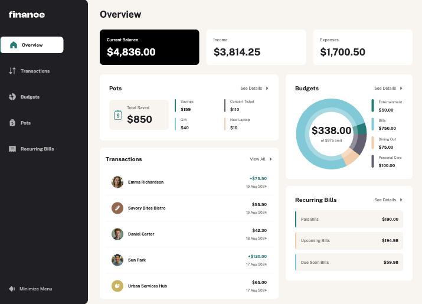
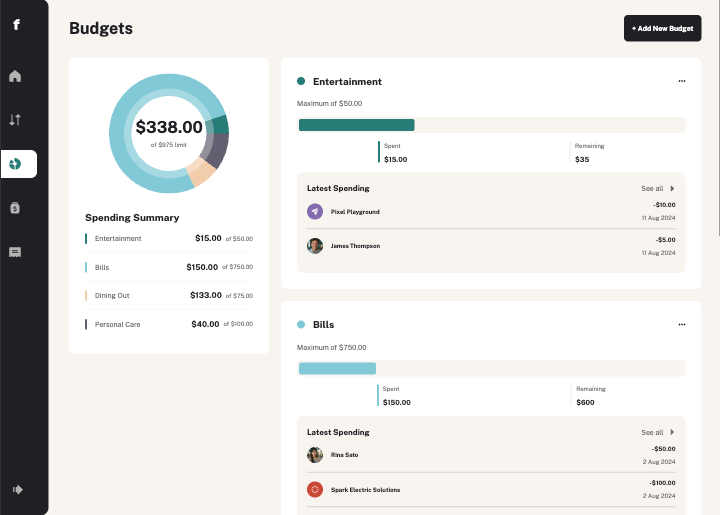
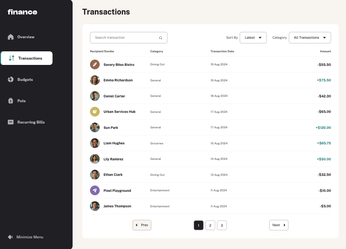
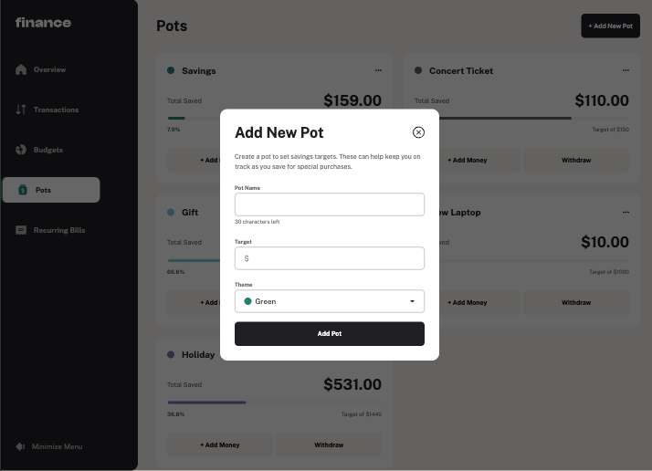
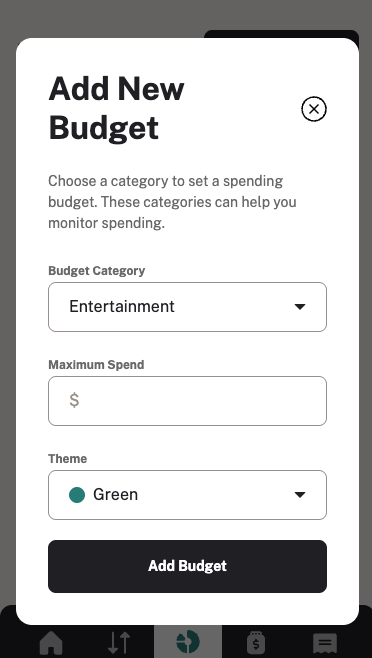
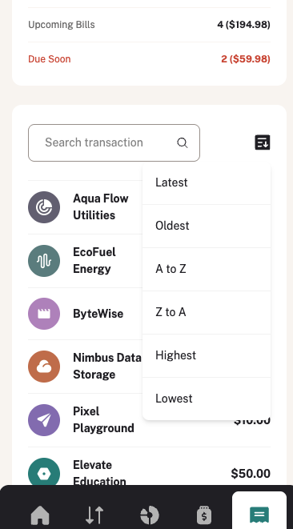

# Finance App — Fullstack

A personal finance management app built fullstack, inspired by the
[Personal Finance App challenge on Frontend Mentor](https://www.frontendmentor.io/challenges/personal-finance-app-JfjtZgyMt1).

## Table of contents

- [Overview](#overview)
- [Demo & Screenshots](#-demo--screenshots)
- [Tech Stack](#-tech-stack)
- [Features](#-features)
- [Architecture](#-architecture)
- [Demo Account](#-demo-account)
- [Links](#-links)
- [What I Learned](#-what-i-learned)
- [Author](#-author)

## Overview

A fullstack personal finance dashboard with authentication, real data persistence and a production-ready deployment. Users can manage budgets, saving pots, transactions and recurring bills — all scoped to their own account.

## 🎬 Demo & Screenshots

### 💻 Desktop Views

  
  

  
  

### 📱 Mobile Version

  
  

## 🛠️ Tech Stack

### Frontend

- **Language:** TypeScript
- **Framework:** React 19 + Tailwind CSS v4
- **Data Fetching:** React Query (TanStack Query v5)
- **HTTP Client:** Axios with JWT interceptor
- **UI State:** Jotai
- **Animations:** Framer Motion
- **Forms:** React Hook Form
- **Routing:** React Router v6
- **Build Tool:** Vite
- **Deploy:** Vercel

### Backend

- **Runtime:** Node.js + Express
- **Database:** MongoDB + Mongoose
- **Auth:** JWT + bcrypt
- **Security:** Helmet, express-rate-limit, express-mongo-sanitize, xss-clean, CORS
- **Deploy:** Railway

## ✨ Features

- 🔐 **Authentication** — Register, Login, JWT protected routes
- 👤 **Multi-user** — each user sees only their own data
- 📊 **Overview Dashboard** — balance, income, expenses and recent transactions
- 💰 **Budget Management** — create, edit, delete budgets with spending tracking
- 🪙 **Saving Pots** — savings goals with deposit and withdraw functionality
- 💳 **Transactions** — search, filter by category, sort and paginate
- 🧾 **Recurring Bills** — paid, due soon and upcoming status
- 🗂️ **Animated Sidebar** — collapsible with Framer Motion
- 📱 **Fully Responsive** — mobile navbar + desktop sidebar
- 🔔 **Toast Notifications** — success and error feedback on every action

## 🏗️ Architecture

### Frontend

- **React Query** — all server state (transactions, budgets, pots, bills, overview)
- **Jotai** — lightweight UI state for sidebar open/close
- **Axios interceptor** — automatically attaches JWT token to every request
- **ProtectedRoute** — redirects unauthenticated users to login
- **Feature-based folder structure** — `hooks/`, `pages/`, `components/`, `context/`

### Backend

- **REST API** — clean routes per resource (`/auth`, `/transactions`, `/budgets`, `/pots`, `/bills`, `/overview`)
- **JWT middleware** — `protect` runs before every private route
- **User scoping** — every query filters by `req.user._id`
- **Global error handler** — catches all errors including CastError, ValidationError, JWT errors
- **APIFeatures** — reusable class for filtering, sorting and pagination
- **MongoDB aggregations** — overview stats computed server-side with `$match`, `$group`, `$cond`

## 🔑 Demo Account

Email: demo@finance.com
Password: Demo1234!

## 🔗 Links

- 🌐 **Live Demo:** [View Application](https://finance-app-melaniecrzx.vercel.app/)
- 💻 **Frontend Repo:** [GitHub](https://github.com/Melaniecrzx/Finance-app-V2.git)
- ⚙️ **Backend Repo:** [GitHub](https://github.com/Melaniecrzx/Finance-App.git)

## 💡 What I Learned

- Building a fullstack REST API with Express and MongoDB
- JWT authentication — signup, login, protect middleware, token interceptor
- React Query — useQuery, useMutation, invalidateQueries, cache invalidation on success
- MongoDB aggregations — `$match`, `$group`, `$cond` for server-side stats
- User-scoped data — filtering every query by `req.user._id`
- Security best practices — Helmet, rate limiting, NoSQL sanitization, XSS protection
- Deploying a fullstack app — Railway for the backend, Vercel for the frontend

## 👤 Author

- GitHub — [@Melaniecrzx](https://github.com/Melaniecrzx)
- Portfolio — [https://portfolio-melaniecrzx.vercel.app](https://portfolio-melaniecrzx.vercel.app)
